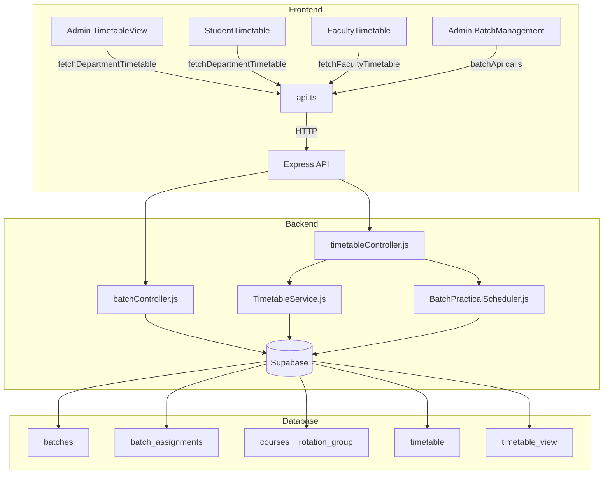

# Design Document: Batch Practical Scheduling

## Overview

This feature extends the existing timetable system to support batch-based practical lab scheduling. Students in a semester are divided into named batches (e.g., B1, B2, B3). During a designated practical slot, all batches run simultaneously but in different lab rooms with different practical subjects. A rotation cycle ensures every batch completes every practical subject exactly once over N weeks.

The implementation touches four layers:
1. **Database** – two new Supabase tables (`batches`, `batch_assignments`) and a migration to add `rotation_group` to `courses`.
2. **Backend** – a new `batchController.js`, a new `BatchPracticalScheduler` service class, and extensions to `timetableController.js`.
3. **API** – new REST routes under `/api/batches`.
4. **Frontend** – extended `TimetableGridView`, updated student/admin/faculty timetable pages, and a new Batch Management admin page.

---

## Architecture



---

## Components and Interfaces

### Backend: BatchPracticalScheduler

A new service class responsible solely for batch rotation logic. It is invoked by `timetableController.js` after the main `TimetableService` has run.

```js
class BatchPracticalScheduler {
  constructor(batches, practicalCourses, rooms, timeSlots, existingSchedule)

  // Entry point: returns array of batch_assignment records
  generateBatchAssignments()

  // Groups practical courses by rotation_group
  groupByRotationGroup(courses)

  // Validates that |courses in group| === |batches|
  validateGroupSize(group, batches)

  // Finds a free consecutive 2-slot window not already used by existingSchedule
  findPracticalSlot(group, existingSchedule)

  // Builds the N-week rotation matrix (Latin square)
  buildRotationMatrix(batches, courses)

  // Assigns distinct rooms to batches for a slot
  assignRooms(batches, availableLabRooms, day, slotPair)
}
```

### Backend: batchController.js

Standard CRUD controller following the existing pattern (asyncHandler + AppError + supabase).

Endpoints:
- `POST /api/batches` → `createBatch`
- `GET /api/batches` → `getBatches` (query: `department`, `semester`)
- `PUT /api/batches/:id` → `updateBatch`
- `DELETE /api/batches/:id` → `deleteBatch`
- `GET /api/batches/:id/assignments` → `getBatchAssignments`

### Frontend: BatchManagement page

New admin page at `src/pages/admin/BatchManagement.tsx`. Allows admins to:
- View batches per department/semester
- Create / rename / delete batches
- See batch assignments

### Frontend: TimetableGridView extension

`TimetableCell` in `src/types/index.ts` gains an optional `batchAssignments` field:

```ts
export interface BatchAssignmentCell {
  batchName: string;
  courseCode: string;
  courseName: string;
  facultyName: string;
  room: string;
}

export interface TimetableCell {
  courseCode: string;
  courseName: string;
  facultyName: string;
  room: string;
  type: "lecture" | "lab" | "seminar";
  batchName?: string;                        // for student view
  batchAssignments?: BatchAssignmentCell[];  // for admin view (all batches)
}
```

`TimetableGridView.tsx` renders a multi-batch cell when `batchAssignments` is present.

---

## Data Models

### Database Schema

```sql
-- New table: batches
CREATE TABLE batches (
  id          UUID PRIMARY KEY DEFAULT gen_random_uuid(),
  name        VARCHAR(20) NOT NULL,
  department  TEXT NOT NULL,
  semester    INTEGER NOT NULL,
  created_at  TIMESTAMPTZ DEFAULT now(),
  UNIQUE (name, department, semester)
);

-- New table: batch_assignments
CREATE TABLE batch_assignments (
  id          UUID PRIMARY KEY DEFAULT gen_random_uuid(),
  batch_id    UUID NOT NULL REFERENCES batches(id) ON DELETE CASCADE,
  course_id   UUID NOT NULL REFERENCES courses(id) ON DELETE CASCADE,
  room_id     UUID NOT NULL REFERENCES rooms(id),
  day         TEXT NOT NULL,
  time_slot   UUID NOT NULL REFERENCES time_slots(id),
  week_number INTEGER NOT NULL,
  department  TEXT NOT NULL,
  semester    INTEGER NOT NULL,
  created_at  TIMESTAMPTZ DEFAULT now(),
  UNIQUE (batch_id, course_id, week_number)
);

-- Migration: add rotation_group to courses
ALTER TABLE courses ADD COLUMN IF NOT EXISTS rotation_group TEXT;
ALTER TABLE courses ADD COLUMN IF NOT EXISTS course_type TEXT DEFAULT 'lecture';
```

### TypeScript Types (additions to src/types/index.ts)

```ts
export interface Batch {
  id: string;
  name: string;
  department: string;
  semester: number;
  created_at?: string;
}

export interface BatchAssignment {
  id: string;
  batch_id: string;
  course_id: string;
  room_id: string;
  day: string;
  time_slot: string;
  week_number: number;
  department: string;
  semester: number;
}
```

---

## Correctness Properties

*A property is a characteristic or behavior that should hold true across all valid executions of a system — essentially, a formal statement about what the system should do. Properties serve as the bridge between human-readable specifications and machine-verifiable correctness guarantees.*

### Property 1: Batch CRUD round-trip

*For any* valid (name, department, semester) triple, creating a batch and then listing batches for that department and semester should return a list that includes the created batch.

**Validates: Requirements 1.1, 1.2, 8.1, 8.2**

---

### Property 2: Batch update round-trip

*For any* existing batch and any valid new name, updating the batch name and then fetching the batch by id should return the new name.

**Validates: Requirements 1.3, 5.4, 8.3**

---

### Property 3: Batch delete cascade

*For any* batch that has associated batch_assignments, deleting the batch should result in the batch no longer appearing in the list AND all its batch_assignments being removed.

**Validates: Requirements 1.4, 8.4, 9.3**

---

### Property 4: Duplicate batch rejection

*For any* (name, department, semester) triple, attempting to create a second batch with the same triple should be rejected with an error.

**Validates: Requirements 1.5, 9.4**

---

### Property 5: Batch name validation

*For any* string that is either empty or longer than 20 characters, attempting to create a batch with that name should be rejected. *For any* non-empty string of at most 20 characters, the creation should succeed.

**Validates: Requirements 1.6**

---

### Property 6: Practical course classification

*For any* course with `course_type` equal to `lab` or `practical`, the `isPracticalCourse` function should return `true`. *For any* course with any other `course_type`, it should return `false`.

**Validates: Requirements 2.2**

---

### Property 7: Rotation group same-slot invariant

*For any* generated schedule containing a rotation group, all batch_assignments belonging to that rotation group in the same week should share the same `day` and `time_slot` pair.

**Validates: Requirements 2.4, 3.4**

---

### Property 8: Rotation group size mismatch error

*For any* rotation group where the number of practical courses does not equal the number of batches for that department and semester, the scheduler should return a descriptive error and produce no batch_assignments for that group.

**Validates: Requirements 2.5**

---

### Property 9: Rotation bijection per week

*For any* generated schedule and any single week number, the mapping from batches to practical courses within a rotation group should be a bijection: no two batches share the same course, and each course is assigned to exactly one batch.

**Validates: Requirements 3.1, 3.2**

---

### Property 10: Full rotation coverage

*For any* rotation group with N practical courses and N batches, after N weeks of generated assignments, every (batch, course) pair should appear in the assignments exactly once.

**Validates: Requirements 3.3**

---

### Property 11: Distinct rooms per practical slot

*For any* practical slot in the generated schedule, no two batch_assignments in the same slot should share the same `room_id`.

**Validates: Requirements 3.5**

---

### Property 12: No double-booking

*For any* generated schedule, no two entries (from either `timetable` or `batch_assignments`) should share the same (`room_id`, `day`, `time_slot`) triple, the same (`faculty_id`, `day`, `time_slot`) triple, or the same (`batch_id`, `day`, `time_slot`) triple.

**Validates: Requirements 4.1, 4.2, 4.3**

---

### Property 13: Student timetable batch filter

*For any* student belonging to batch B, their timetable should contain only the batch_assignment records where `batch_id` equals B's id, and no batch_assignment records for other batches in the same slot.

**Validates: Requirements 5.1**

---

### Property 14: Cell rendering completeness

*For any* batch_assignment record, the rendered timetable cell should contain the practical course name, the faculty name, the room name, and the batch name — all non-empty.

**Validates: Requirements 5.2, 6.2, 7.1**

---

### Property 15: Admin cell shows all batch entries

*For any* practical slot with N batch_assignments, the admin timetable cell rendered for that slot should contain exactly N batch sub-entries.

**Validates: Requirements 6.1**

---

### Property 16: API 400 on invalid input

*For any* batch API request that is missing a required field (name, department, or semester), the response HTTP status should be 400.

**Validates: Requirements 8.6**

---

### Property 17: API 404 on missing resource

*For any* batch API request that references a batch id that does not exist in the database, the response HTTP status should be 404.

**Validates: Requirements 8.7**

---

## Error Handling

| Scenario | Behaviour |
|---|---|
| Rotation group size mismatch | Return 400 with message listing the group id and counts |
| Insufficient lab rooms for a slot | Log warning, skip that rotation group's slot assignment |
| Duplicate batch name | Return 400 with "Batch name already exists for this department and semester" |
| Invalid batch name (empty / >20 chars) | Return 400 with field-level validation message |
| Batch not found | Return 404 |
| Supabase query failure | Return 500 via existing AppError pattern |
| Faculty double-booking during batch scheduling | Log warning, attempt next available slot; if none, skip and warn |

---

## Testing Strategy

### Dual Testing Approach

Both unit tests and property-based tests are required and complementary.

- **Unit tests** cover specific examples, edge cases (empty batch list, single batch, no lab rooms), and integration points between `BatchPracticalScheduler` and `TimetableService`.
- **Property-based tests** verify universal correctness properties across randomly generated inputs (random batch counts, random course sets, random room pools).

### Property-Based Testing Library

- **Backend (Node.js)**: [`fast-check`](https://github.com/dubzzz/fast-check) — minimum 100 runs per property.
- **Frontend (TypeScript/Vitest)**: [`@fast-check/vitest`](https://github.com/dubzzz/fast-check/tree/main/packages/vitest) — minimum 100 runs per property.

### Property Test Tag Format

Each property test must include a comment:

```
// Feature: batch-practical-scheduling, Property N: <property title>
```

### Unit Test Focus Areas

- `BatchPracticalScheduler.buildRotationMatrix` with 2, 3, and 4 batches
- `BatchPracticalScheduler.validateGroupSize` with matching and mismatched counts
- `batchController` CRUD operations with mocked Supabase
- `TimetableGridView` rendering of multi-batch cells
- Student timetable filtering by batch id
- API validation middleware (400 / 404 responses)

### Property Test Coverage

Each of the 17 correctness properties above maps to exactly one property-based test. Tests are placed as sub-tasks close to the implementation task they validate.
